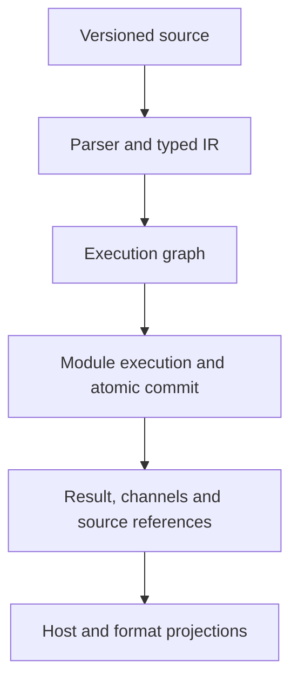

# Architecture and source map

Textabana compiles readable source into an explicit execution plan and commits a primary rendered value together with typed channel events and their source references. Hosts own the editor and transport. The kernel owns document revisions and execution semantics.

## Current responsibilities

| Source | Responsibility and boundary |
|---|---|
| `runtime/textabana.grammar`, `runtime/parser.js` | Lezer parsing, lossless CST, AST, typed IR, recovery and Unicode source spans. |
| `runtime/execution-graph.js` | Execution graph, dependency order and stage/cache identities. |
| `runtime/stage-cache.js`, `runtime/run-policy.js` | Conservative reuse, transactional observations and cooperative execution limits. |
| `runtime/worker-entry.js` | Document lifecycle, admission/loading, orchestration, channels, source metadata, built-in adapters and lab conformance. These responsibilities still need separation. |
| `runtime/semantic-identity.js`, `runtime/semantic-contract.js` | Separate SHA-256 artifact identities and structural/reference validation. Verification does not rerun transformations. |
| `sdk/`, `cli/` | Host clients, editor bindings, Node transport and command-line entry points. Python's host client calls the JavaScript kernel. |
| `reference/`, `conformance/` | Independent implementations of explicitly limited profiles, frozen cases and source-bound reports. |
| `app/` | The editor, playground and documentation presentation. Some fixture definitions remain embedded here until their own extraction step. |
| `docs/reference/`, `contracts/` | Authored specification documents and executable artifact schemas. |

## Invariants to preserve during refactoring

Accepted runs capture an immutable document revision. Secure transported packages are checked before any entrypoint executes; actual exports are checked after loading and before transformation. Domain output becomes durable only after a successful atomic commit. Failed or cancelled runs do not replace the last committed metadata baseline.

Positions at the kernel boundary use Unicode code points. Editor adapters convert UTF-16. Metadata streaming delivers committed changes under host credit; it is not continuous stage streaming or a general memory bound. Adapters project committed results without mutating them.

The JavaScript loader executes trusted code. Package grants and declared effects do not create a general sandbox. Lab hashes, semantic artifact identities, document revisions and transport request IDs have different purposes and must remain separate.

## Authority

The [specification](reference/README.md) defines the target contracts. Each versioned profile defines the exact subset an implementation can claim. Tests provide evidence for named behavior; reports bind a particular suite and source revision. Plans and historical implementation notes describe work and do not override contracts.

The next refactor should extract responsibilities from the Worker while keeping the same public messages and frozen profile outcomes. A directory move alone is not a new architecture or proof of conformance.
