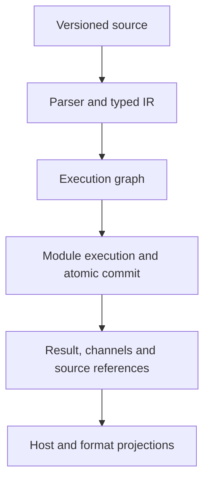

# Architecture and source map

Textabana compiles readable source into an explicit execution plan and commits a primary rendered value together with typed channel events and their source references. Hosts own the editor and transport. The kernel owns document revisions and execution semantics.

## Current responsibilities

| Source | Responsibility and boundary |
|---|---|
| `runtime/textabana.grammar`, `runtime/parser.js` | Lezer parsing, lossless CST, AST, typed IR, recovery and Unicode source spans. |
| `runtime/execution-graph.js` | Execution graph, dependency order and stage/cache identities. |
| `runtime/stage-cache.js`, `runtime/run-policy.js` | Conservative reuse, transactional observations and cooperative execution limits. |
| `runtime/worker-entry.js` | Worker transport dispatch, run queue, cancellation and execution orchestration. Owns one editor kernel and module loader. |
| `runtime/editor-kernel.js` | Per-instance document revisions, parser snapshots, subscriptions, metadata deltas and accepted post-commit baselines. Receives message delivery and the active/queued-run guard from the dispatcher. |
| `runtime/module-admission.js`, `runtime/module-loader.js` | Pure package/lock/grant checks and post-load export checks; separate trusted JS loading with a per-instance cache cleared at run start. |
| `runtime/channels.js`, `runtime/result-envelope.js` | Per-run channel collection, payload/serialization checks, anchors and source maps; construction of atomic committed or rolled-back results. |
| `runtime/channel-schema.js` | Ajv2020 compilation and validation under the versioned channel policy; rejects unsupported schema features and isolates each descriptor's registry. |
| `runtime/adapters.js`, `runtime/lab-conformance.js` | Built-in post-commit projections and lab-only profile/golden checks. They do not own document state or execute modules. |
| `runtime/lab-values.js`, `runtime/result-references.js`, `runtime/runtime-errors.js` | Existing lab normalization/hashes, operational-reference normalization and error constructors. Lab normalization is separate from RFC 8785 canonical JSON. |
| `runtime/semantic-identity.js`, `runtime/semantic-contract.js` | Separate SHA-256 artifact identities and structural/reference validation. Verification does not rerun transformations. |
| `sdk/typescript/runtime-types.ts`, `sdk/typescript/responses.ts` | Shared runtime data and all command response/failure/metadata types; independent of the application and hosting platform. |
| `sdk/`, `cli/` | Host clients, editor bindings, Node transport and command-line entry points. Python's host client calls the JavaScript kernel. |
| `reference/`, `conformance/` | Independent implementations of explicitly limited profiles, frozen cases and source-bound reports. |
| `app/` | The editor, playground and documentation presentation. Some fixture definitions remain embedded here until their own extraction step. |
| `docs/reference/`, `contracts/` | Authored specification documents and executable artifact schemas. |

See the [kernel boundary reference](../runtime/README.md) for operation inputs, state ownership, errors and commit ordering.

## Invariants to preserve during refactoring

Accepted runs capture an immutable document revision. Secure transported packages are checked before any entrypoint executes; actual exports are checked after loading and before transformation. Domain output becomes durable only after a successful atomic commit. Failed or cancelled runs do not replace the last committed metadata baseline.

Positions at the kernel boundary use Unicode code points. Editor adapters convert UTF-16. Metadata streaming delivers committed changes under host credit; it is not continuous stage streaming or a general memory bound. Adapters project committed results without mutating them.

The JavaScript loader executes trusted code. Package grants and declared effects do not create a general sandbox. Lab hashes, semantic artifact identities, document revisions and transport request IDs have different purposes and must remain separate.

## Authority

The [specification](reference/README.md) defines the target contracts. Each versioned profile defines the exact subset an implementation can claim. Tests provide evidence for named behavior; reports bind a particular suite and source revision. Plans and historical implementation notes describe work and do not override contracts.

The dispatcher remains responsible for scheduling and execution coordination. Extracted modules have no dependency on `worker-entry.js` or `app/`; lower-level channel/result code does not depend on adapter implementations. Editor and loader factories isolate mutable state between kernel instances. The editor receives an `isRunBusy` callback so cache imports keep the original active-or-queued exclusion without exposing scheduler sets.

Secure admission precedes loading, export validation precedes transformation, and result construction precedes adapter/conformance evaluation and editor completion. The existing post-commit gate still controls cache acceptance. `tests/kernel-boundaries.test.mjs` verifies instance isolation and loader reset; the broader regression/profile suites preserve revision, transaction, event, cancellation and identity behavior. This separation adds no standards or conformance claim.
